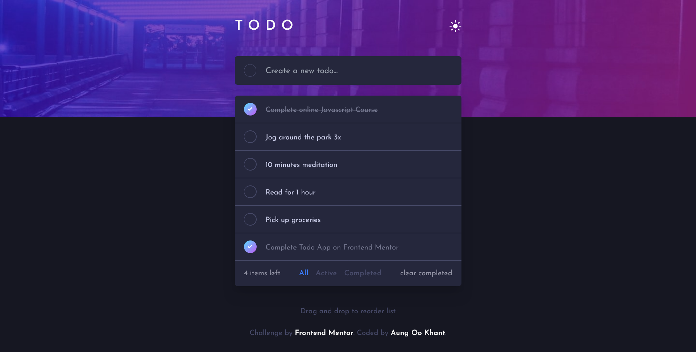

# Frontend Mentor - Todo app solution

This is a solution to the [Todo app challenge on Frontend Mentor](https://www.frontendmentor.io/challenges/todo-app-Su1_KokOW). Frontend Mentor challenges help you improve your coding skills by building realistic projects.

## Table of contents

- [Overview](#overview)
  - [The challenge](#the-challenge)
  - [Screenshot](#screenshot)
  - [Links](#links)
- [My process](#my-process)
  - [Built with](#built-with)
  - [What I learned](#what-i-learned)
  - [Continued development](#continued-development)
  - [Useful resources](#useful-resources)
- [Author](#author)

## Overview

### The challenge

Users should be able to:

- View the optimal layout for the app depending on their device's screen size
- See hover states for all interactive elements on the page
- Add new todos to the list
- Mark todos as complete
- Delete todos from the list
- Filter by all/active/complete todos
- Clear all completed todos
- Toggle light and dark mode
- **Bonus**: Drag and drop to reorder items on the list

### Screenshot

### Links

- Solution URL: [https://github.com/aok207/Todo-app-with-drag-and-drop](https://github.com/aok207/Todo-app-with-drag-and-drop)
- Live Site URL: [https://todo-app-frontend-mentor-deploy.vercel.app/](https://todo-app-frontend-mentor-deploy.vercel.app/)

## My process

### Built with

- React
- Tailwind
- Typescript
- CSS custom properties
- Vite
- Mobile-first workflow

### What I learned

I haven't touch on drag and drop functionality yet, so this was the perfect opportunity to learn how to do it. And not gonna like, it was a little bit challenging but worth it.

### Useful resources

- [Drap And Drop Tuto](https://www.youtube.com/watch?v=PyGqKt86gU0) - This video helped me with the drap and drop funcitonality.
- [Dark mode tailwind](https://www.youtube.com/watch?v=NxIBnvb8B7Y) - I recommedn this video for adding dark mode with tailwind.

## Author

- Website - [Aung Oo Khant](https://aungookhant-portfolio.onrender.com/)
- Frontend Mentor - [@aok207](https://www.frontendmentor.io/profile/aok207)
- Facebook - [Aung OO Khant](https://www.facebook.com/aungookhant.aung)
